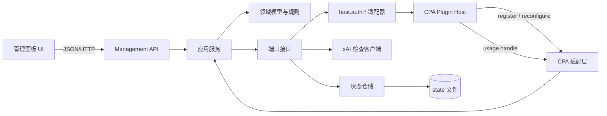

# 01. 分层架构

## 1. 架构总览

系统采用单插件进程内的分层结构。CPA 是唯一宿主和 auth 真相源；插件 state 只保存派生统计、人工检查结果、操作基线和审计信息。

## 2. 分层职责

### 2.1 CPA 适配层

负责把不稳定的宿主 ABI 转换为内部稳定端口：

- 插件注册、能力声明、路由与静态资源挂载。
- 配置重载和版本/能力协商。
- usage 事件校验、归一化、去重键提取。
- `host.auth.*` 请求和宿主错误映射。
- 管理请求的宿主认证上下文提取。

该层不得包含套餐判断、失败阈值、删除保护等领域规则。

### 2.2 领域层

包含无 I/O 的模型和规则：

- Account、Health、Tier、Priority、UsageCounters、Settings。
- usage 累计与数据质量判定。
- 连续/窗口失败计数与降权决策。
- 优先级基线和恢复规则。
- 删除保护判定。
- 设置合法性与状态转换不变量。

领域层只接收内部 `AuthFileID`，不知道 CPA JSON、HTTP 或磁盘格式。

### 2.3 应用服务层

编排用例和事务边界：

- 同步账号清单。
- 处理 usage 事件。
- 执行健康、套餐、Responses 检查。
- 批量启停、降权恢复和安全清理。
- 读取/更新设置。
- 生成操作审计和逐项结果。

应用服务依赖端口接口，不依赖具体 CPA SDK、文件格式或 UI 框架。

### 2.4 基础设施层

- 状态仓储：原子快照、迁移、备份、锁。
- CPA auth 网关：列出、更新优先级、启停、删除。
- xAI 检查客户端：仅在人工用例中发起受限请求。
- 时钟、ID 生成、结构化日志、指标。

### 2.5 HTTP 与 UI

Management API 负责输入校验、鉴权结果消费、DTO 转换和状态码，不承载领域判断。UI 负责展示、确认和轮询操作状态，不直接调用 CPA auth 接口，也不持有长期管理密钥。

## 3. 进程模型

### 3.1 首选模型：宿主内单实例插件

- 插件由 CPA 加载并调用 `register`。
- 插件在同一进程内接收 usage 与管理请求。
- 内部使用有界 worker pool 执行人工检查；并发度来自 Settings。
- state 写入由单写入协调器串行化，读取使用不可变快照。
- shutdown 时停止接收新任务、等待短时排空并刷新快照。

### 3.2 多实例限制

MVP 不支持多个 CPA 进程共享同一 state 文件。若检测到文件锁已被占用，第二实例注册失败并返回明确诊断。未来若 CPA 需要多实例，应改用支持租约和幂等写入的外部存储，而不是共享 JSON 文件。

### 3.3 生命周期

1. `register`：协商 ABI、校验 host capabilities、打开并迁移 state、注册 usage handler、管理路由和资源。
2. 启动同步：调用 `host.auth.list` 建立账号投影；不触发外部健康/套餐检查。
3. 正常运行：usage 快速入队或同步更新内存状态，管理请求走应用服务。
4. `reconfigure`：校验新设置，原子替换运行时配置；非法配置保留旧值。
5. shutdown：拒绝新写操作，排空状态写入，释放锁。

## 4. 关键数据流

### 4.1 usage 累计与失败降权

1. CPA 发送 usage 事件，事件必须携带可信 `auth_file_id`。
2. 适配层校验版本、事件 id、token 非负性并规范化。
3. 应用服务按事件 id 去重，交给领域模型累计真实 token。
4. 成功事件清零失败序列；失败事件按设置累计。
5. 达到阈值时，领域产生 `PriorityDemotionRequested`，记录当前优先级基线。
6. 应用服务调用 `host.auth.set_priority(auth_file_id, -100)`。
7. 成功则更新投影和审计；失败则保持“降权待重试/失败”状态，但不自行修改 auth 文件。

降权决策绝不使用 `provider` 字符串进行账号映射。没有可信身份的失败事件只进入“未归因事件”指标。

### 4.2 管理面板读取

1. 浏览器请求插件管理路由，由 CPA 管理鉴权保护。
2. API 查询 host auth 清单和插件状态快照。
3. 应用服务按 `auth_file_id` 合并为只读 AccountView。
4. UI 显示数据更新时间和数据质量，不把陈旧检查结果伪装成实时状态。

### 4.3 人工检查

1. 管理员选择账号和检查类型。
2. API 创建有过期时间的 operation，立即返回 `operation_id`。
3. worker pool 按设置限流，使用 CPA 提供的受控凭据/代理能力发起检查。
4. 每个账号独立记录成功、失败、超时或取消；结果写入 state。
5. UI 轮询操作端点直到终态，刷新账号视图。

### 4.4 安全删除

1. UI 先请求删除预检，提交精确 `auth_file_id` 与 `file_name`。
2. 服务重新读取 host auth 清单，执行保护规则，返回短期确认令牌和风险摘要。
3. 管理员再次提交相同身份、精确文件名、确认令牌和确认文本。
4. 服务再次校验身份未变化、令牌未过期、保护规则仍通过。
5. 仅调用 `host.auth.delete`；成功后保留墓碑和审计，不立即抹除历史统计。

## 5. 一致性模型

- CPA auth 元数据为强真相源，插件 AccountView 是短时投影。
- usage 计数以至少一次投递为前提，通过事件 id 去重实现效果上的一次累计。
- 批量操作不是跨账号事务；返回逐项结果。
- 单账号写操作使用 `expected_revision` 或等价条件写，避免覆盖外部变更。
- state 内单账号更新和事件去重记录应在同一持久化提交中完成。

## 6. 可观测性

- 日志字段：`request_id`、`operation_id`、哈希化 `auth_file_id`、动作、结果、错误码、耗时。
- 禁止记录 OAuth token、管理密钥、完整 auth 文件内容和 Responses 原文。
- 指标：usage 已处理/去重/未归因/非法事件数、state 写失败、降权尝试结果、检查队列深度、操作耗时。
- 管理端健康信息区分插件自身健康、state 健康和 host capability 健康。

## 7. 强制模块边界

- UI 组件不得直接实现 API 请求重试、领域阈值或删除保护。
- HTTP handler 不得直接读写 state 文件或调用 xAI。
- CPA DTO 不得穿透到领域层。
- Repository 不得决定是否降权或删除。
- 每个模块公开最小接口，禁止循环依赖。
- 设计目标是小文件、单职责；评审拒绝“单文件承载路由、状态、业务和页面”的实现。

## 8. 插件不能做什么

- 不能保证 CPA 最终会选择哪个账号处理请求。
- 不能在 CPA 未暴露原子 host API 时安全地模拟该能力。
- 不能从缺少 auth 身份的 usage 事件可靠推断责任账号。
- 不能证明供应商套餐永久有效；只能记录某次人工核验观察。
- 不能把本地 token 上限强制为供应商配额，除非 CPA 提供正式调度/阻断扩展点。
