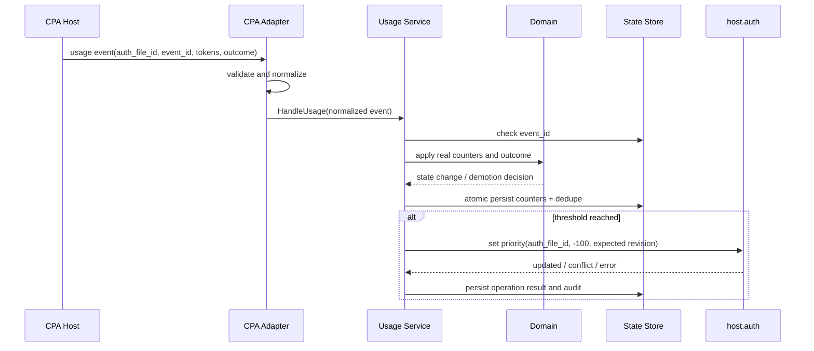
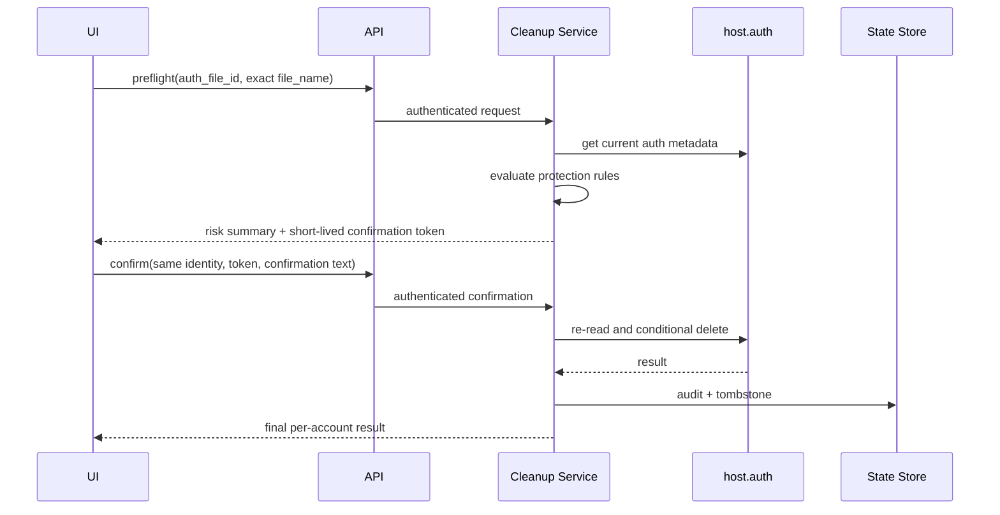

# 数据流图

## usage 与降权

```mermaid
sequenceDiagram
  participant CPA as CPA Host
  participant A as CPA Adapter
  participant U as Usage Service
  participant D as Domain
  participant S as State Store
  participant H as host.auth

  CPA->>A: usage event(auth_file_id, event_id, tokens, outcome)
  A->>A: validate and normalize
  A->>U: HandleUsage(normalized event)
  U->>S: check event_id
  U->>D: apply real counters and outcome
  D-->>U: state change / demotion decision
  U->>S: atomic persist counters + dedupe
  alt threshold reached
    U->>H: set priority(auth_file_id, -100, expected revision)
    H-->>U: updated / conflict / error
    U->>S: persist operation result and audit
  end
```

## 安全删除

```mermaid
sequenceDiagram
  participant UI
  participant API
  participant APP as Cleanup Service
  participant HOST as host.auth
  participant STATE as State Store

  UI->>API: preflight(auth_file_id, exact file_name)
  API->>APP: authenticated request
  APP->>HOST: get current auth metadata
  APP->>APP: evaluate protection rules
  APP-->>UI: risk summary + short-lived confirmation token
  UI->>API: confirm(same identity, token, confirmation text)
  API->>APP: authenticated confirmation
  APP->>HOST: re-read and conditional delete
  HOST-->>APP: result
  APP->>STATE: audit + tombstone
  APP-->>UI: final per-account result
```
